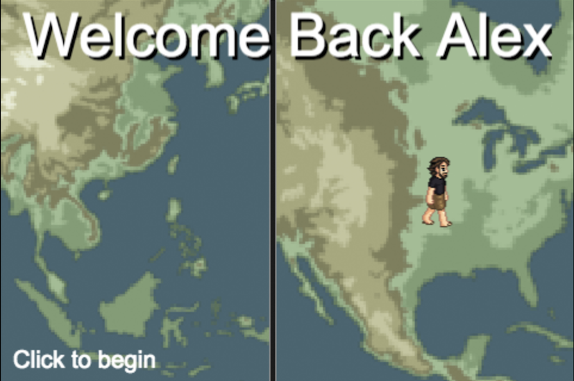

As Christmas 2014 approached I was faced with the yearly conundrum of what to gift to my various loved ones. I think I did an adequate job selecting items for most people, but I wanted to get my brother something good since he’s been out of the country for two years teaching English in Korea.

I saw this as a good opportunity to finally try out the [Phaser framework](https://phaser.io) that I’ve been following for quite some time, but never really used. Phaser is a game-making library written in JavaScript that provides a ton of great utilities for making 2D games that work on the web.

Phaser.io Given that Christmas was my deadline, and I started in mid-November, I had to be pretty modest in my expectations. Learning a new framework, and coding everything by hand (as opposed to using graphical tools like Construct 2 or Unity) further exacerbated the time constraints. Luckily, with the help of several online examples and some darn good official documentation, I was able to squeek out something the kind-of passes as a “game” and provided a few hearty minutes of entertainment on Christmas day.

The game itself follows my brother, Alex, on his journey home from Korea. In level one, Alex must protect the school-children from the invading Zerglings. In real life, Alex spent a few months bumming around the South Pacific backpacking through jungles and across beaches. So in level two, the objective is to cross the beach, avoiding obstacles and find the lovely lady. Finally, Alex reaches home (Wisconsin) and decides to take our parent’s new dog, Sophie, for a walk – in the middle of the street! Avoid the cars and win the game!

The source code is available on Github, and I can’t promise that it’s great. The modules are haphazardly written and there’s definitely some copy-pasta going on in a few places, but I tried to take as many queues from the official docs as possible in regards to best practices. Follow the links below to play the game, or view the code.